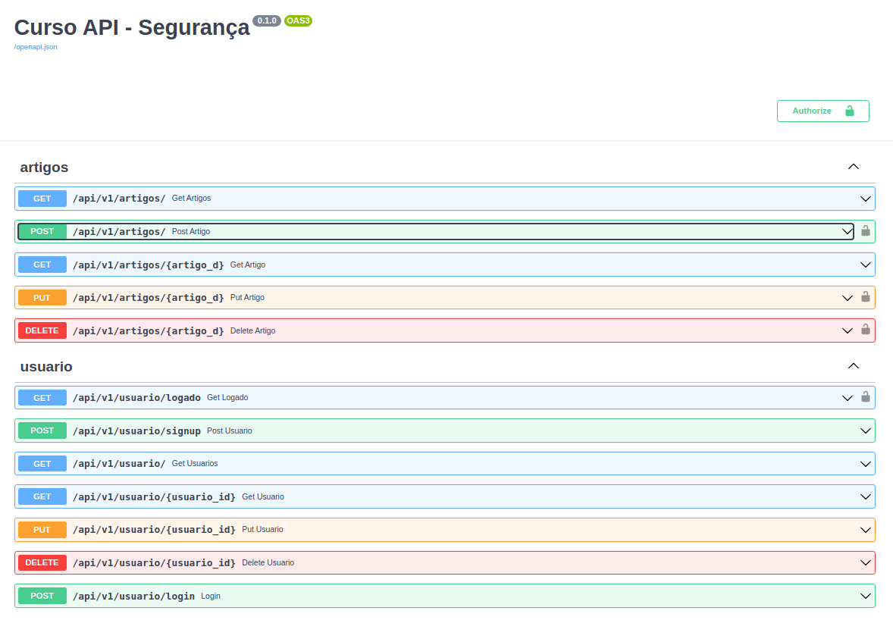

# fastapi-seguranca-autenticacao
Estudando Segurança e Autenticação no FastApi

### Api para fazer operações nos Artigos e Usuarios

### Tecnologias usadas
Projeto de Api usando as tecnologias:
- Poetry
- Python
    - As dependências então no arquivo [pyproject.toml](pyproject.toml)
- Docker/Docker compose
    - Bando de dados Postgresql

### Executando API
Para executar:
- Instalar o poetry
- Instalar docker/Docker Compose
- No diretorio raiz do projeto: 
    - pelo terminal, execute `poetry install`, para instalar as dependências 
    - para subir o banco de dados usando `docker compose`
        - pelo terminal,execute o comando `docker compose up --build -d` 

Com as configurações iniciais feitas, execute o comando `python main.py`

Para ver a documentação da api, com ela executando, basta acessar pelo navegador:
`http://0.0.0.0:8000/docs`

### Api em execução

